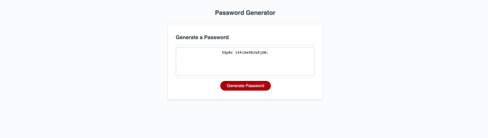

## PW Generator
This repository contains refactored code for Rutgers Coding Bootcamp's third challenge homework, Password generator.
[Click here to see the original code!](https://github.com/coding-boot-camp/friendly-parakeet)

For this week, our task was to refactor a JavaScript code so that it will be a functional password generator. The passwords generated must have 8 to 128 characters and must contain at least a number,special character, upper case character, or a lower case character depending on the User's choices.

Heres is a screenshot of my refactorted code's website!

## Website
Visit my website here!

https://ronnieve23.github.io/PWGenerator/